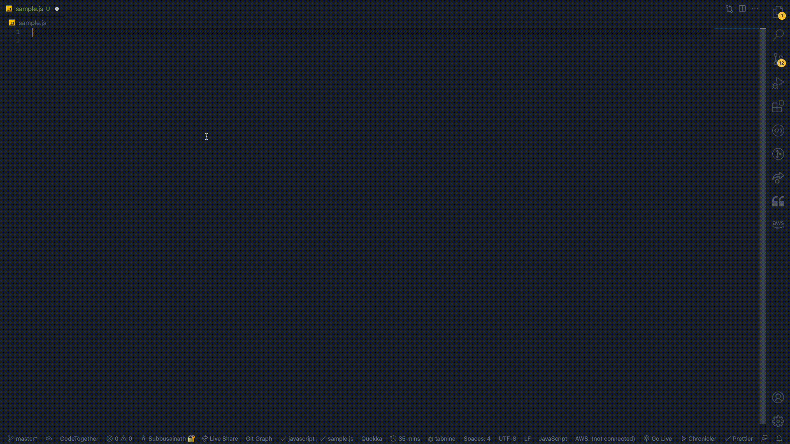

# aws-js-code-snippet README

Welcome to AWS JAVASCRIPT CODE SNIPPET vscode extension. With Use of this extension you can increase your speed of creating AWS service functions with single commands. Hope this extension is very useful to everyone. This project is an open source project. Contribution to this project is most welcome.

## Features

- You can create simple AWS Service functions with the single commands. I have created snippets for AWS S3,SQS and SNS services for now.

- Use `Tab->` to jumping between the highlighted texts to edit the text as per your desires

  

## Requirements

Before Install this VSCode Extension for AWS Code Snippet. Please install AWS-SDK in your local. By Running this command.

```
npm install aws-sdk
```

## Supported language (file extensions)

- Javascript (.js)

<br>

## Snippet info

#### BASIC Snippet

|  Prefix | Method                                                        |
| ------: | ------------------------------------------------------------- |
| `cas3→` | `const AWS = require('aws-sdk');`,`const s3 = new AWS.S3()`   |
| `casq→` | `const AWS = require('aws-sdk');`,`const sqs = new AWS.SQS()` |
| `casn→` | `const AWS = require('aws-sdk');`,`const sns = new AWS.SNS()` |

### `!s3Upload`

```
const function_name = async () => {
  const Bucket_params = {
    Bucket: "Bucket_Name",
    Keys: "file-path",
    Expires: "bucket-expire-time",
  };
  try {
    const variable1_s3_data = await s3.putObject(Bucket_params).promise();
    console.log("S3 Data ", variable1_s3_data);
    return variable1_s3_data;
  } catch (error) {
    console.error("Put Object to S3 :", error);
    return error;
  }
};

```

### `!s3list`

```
const function_name = async() => {
const Parameter_For_Bucket = {
Bucket: "Bucket_name",
Prefix: "path_name/"
};
try{
const variable_to_store_data = await s3.listObjectV2(Parameter_For_Bucket).promise();
const variable_to_return = variable_to_store_data.Contents;
return variable_to_return;
}catch (error){
console.error("Get Object from S3 :", error);
return error;
}
}

```

### `!s3Get`

```
const function_name = async() => {
const Bucket_params = {
Bucket: "Bucket_Name",
Keys: "file_path"
}
try{
const variable1_s3_data = await s3.getObject(Bucket_params).promise();
console.log("S3 Data ", variable1_s3_data);
return variable1_s3_data;
}catch (error){
console.error("Get Object from S3 :", error);
return error;
}
}

```

### `!s3UWM`

```
const function_name = async() => {
const Bucket_params = {
Bucket: "Bucket_Name",
Keys: "file-path",
Expires: "bucket-expire-time",
Metadata: {
"metadata1":"value1"
}
}
try{
const variable1_s3_data = await s3.putObject(Bucket_params).promise();
console.log("S3 Data ", variable1_s3_data);
return variable1_s3_data;
}catch (error){
console.error("Put Object to S3 :", error);
return error;
}
}

```

### `!s3C`

```
const function_name = async() => {
const Bucket_params = {
Bucket: "Destination-Bucket-Name",
CopySource: "Source-Bucket-name/",
Keys: "file-path"
}
try{
const variable1_s3_data = await s3.copyObject(Bucket_params).promise();
console.log("Copied S3 Data ", variable1_s3_data);
return variable1_s3_data;
}catch (error){
console.error("Copy Object to S3 :", error);
return error;
}
}

```

### `!s3Cr`

```
const function_name = async() => {
const Bucket_params = {
Bucket: "Bucket-name",
CreateBucketConfiguration: {
LocationConstraint: "Bucket-Region-name"
}
};
try{
const variable_1 = await s3.createObject(Bucket_params).promise();
console.log("Bucket created in the selected region");
return variable_1;
} catch (error){
console.error("Error in Creating Bucket: ", error.stack);
return error;
}
}

```

### `!s3D`

```
const function_name = async() => {
const Bucket_params = {
Bucket: "Bucket-name"
};
try{
const variable_1 = await s3.deleteBucket(Bucket_params).promise();
console.log("Bucket deleted successfully......");
return variable_1;
} catch (error){
console.error("Error in Delete Bucket: ", error.stack);
return error;
}
}

```

### `!s3Do`

```
const function_name = async() => {
const Bucket_params = {
Bucket: "Bucket_name",
Key:  "File-path"
};
try{
const variable_1 = await s3.deleteObject(Bucket_params).promise();
console.log("Object deleted successfully......");
return variable_1;
} catch (error){
console.error("Error in Deleting Object in the Bucket: ", error.stack);
return error;
}
}

```

### `!s3GM`

```
const function_name = async() => {
const Bucket_params = {
Bucket: "Bucket_name",
Key:  "File_path"
};
try{
const variable_1 = await s3.headObject(Bucket_params).promise();
console.log("Metadata from object without returning object itself", variable_1);
return variable_1;
} catch (error){
console.error("Error in getting metadata of the object in the Bucket: ", error.stack);
return error;
}
}

```

## SQS Snippets

### `!sqsC`

```
const function_name = async() => {
const SQS_Params = {
QueueName: "Queue_name",
Attributes: {
"QueueAttributeName-1":"Value"
},
Tags: {
"Tag-key":"Tag-Value"
}
};
try{
const variable_1 = await sqs.createQueue(SQS_Params).promise();
console.log("SQS Queue is created successfully....", variable_1);
return variable_1;
} catch (error){
console.error("Error in SQS Queue creation: ", error.stack);
return error;
}
}

```

### `!sqsP`

```
const function_name = async() => {
const SQS_Params = {
QueueUrl: "Queue_name"
};
try{
const variable_1 = await sqs.purgeQueue(SQS_Params).promise();
console.log("SQS Queue is purged successfully....", variable_1);
return variable_1;
} catch (error){
console.error("Error in SQS purging queue: ", error.stack);
return error;
}
}

```

### `!sqsS`

```
const function_name = async() => {
const SQS_Params = {
MessageBody: "Message-details",
QueueUrl: "Queue_name"
};
try{
const variable_1 = await sqs.sendMessage(SQS_Params).promise();
console.log("SQS Message send successfully....", variable_1);
return variable_1;
} catch (error){
console.error("Error in SQS send message: ", error.stack);
return error;
}
}
```

### `!sqsR`

```
const function_name = async() => {
const SQS_Params = {
QueueUrl: "Queue_name",
MaxNumberOfMessages: "MaxNumberOfMessages_value",
ReceiveRequestAttemptId: "ReceiveRequestAttemptId_value",
VisibilityTimeout: "visibilityTimeout_value",
WaitTimeSeconds: "waittimeseconds_value"
};
try{
const variable_1 = await sqs.receiveMessage(SQS_Params).promise();
console.log("SQS Message received successfully....", variable_1);
return variable_1;
} catch (error){
console.error("Error in SQS receive message: ", error.stack);
return error;
}
}
```

### `!sqsL`

```
const function_name = async() => {
const SQS_Params = {
MaxResults: "MaxResults_value",
NextToken: "NextToken_value",
QueueNamePrefix: "QueueNamePrefix_value"
};
try{
const variable_1 = await sqs.listQueues(SQS_Params).promise();
console.log("SQS listed queues successfully....", variable_1);
return variable_1;
} catch (error){
console.error("Error in SQS list queues: ", error.stack);
return error;
}
}
```

### `!sqsG`

```
const function_name = async() => {
const SQS_Params = {
QueueName: "QueueName_value",
QueueOwnerAWSAccountId: "QueueOwnerAWSAccountId_value"
};
try{
const variable_1 = await sqs.getQueueUrl(SQS_Params).promise();
console.log("SQS Get QueueUrl successfully....", variable_1);
return variable_1;
} catch (error){
console.error("Error in SQS Get queueUrl: ", error.stack);
return error;
}
}
```

### `!sqsDM`

```
const function_name = async () => {
  const SQS_Params = {
    QueueUrl: "QueueUrl_value",
    ReceiptHandle: " ReceiptHandle_value",
  };
  try {
    const variable_1 = await sqs.deleteMessage(SQS_Params).promise();
    console.log("SQS message deleted successfully....", variable_1);
    return variable_1;
  } catch (error) {
    console.error("Error in SQS Delete Message: ", error.stack);
    return error;
  }
};
```

### `!sqsDQ`

```
const function_name = async () => {
  const SQS_Params = {
    QueueUrl: "QueueUrl_value",
  };
  try {
    const variable_1 = await sqs.deleteQueue(SQS_Params).promise();
    console.log("SQS Queue deleted successfully....", variable_1);
    return variable_1;
  } catch (error) {
    console.error("Error in SQS Delete Queue: ", error.stack);
    return error;
  }
};
```

### `!sqsDLQ`

```
const function_name = async () => {
  const SQS_Params = {
    QueueUrl: "QueueUrl_value",
    MaxResults: "MaxResults_value",
    NextToken: "NextToken_value",
  };
  try {
    const variable_1 = await sqs
      .listDeadLetterSourceQueues(SQS_Params)
      .promise();
    console.log("SQS Dead LetterSourceQueues lists", variable_1);
    return variable_1;
  } catch (error) {
    console.error("Error in SQS ListDeadLetterSourceQueues: ", error.stack);
    return error;
  }
};
```

## SNS Snippets

### `!snsCT`

```
const function_name = async () => {
  const SNS_Params = {
    Name: "Name_value",
    Attributes: {
      Attributes_Name: "Attributes_value",
    },
    Tags: [{ Tags_Key_1: "Tags_Value_1" }],
  };
  try {
    const variable_1 = await sns.createTopic(SNS_Params).promise();
    console.log("SNS Topic created successfully...", variable_1);
    return variable_1;
  } catch (error) {
    console.error("Error in SNS Create Topic: ", error.stack);
    return error;
  }
};
```

### `!snsGT`

```
const function_name = async () => {
  const SNS_Params = {
    TopicArn: "TopicArn_value",
  };
  try {
    const variable_1 = await sns.getTopicAttributes(SNS_Params).promise();
    console.log("Get Topic Attributes", variable_1);
    return variable_1;
  } catch (error) {
    console.error("Error in SNS Get TopicAttribute: ", error.stack);
    return error;
  }
};
```

### `!snsLT`

```
const function_name = async () => {
  const SNS_Params = {
    NextToken: "NextToken_value",
  };
  try {
    const variable_1 = await sns.listTopics(SNS_Params).promise();
    console.log("List Topics", variable_1);
    return variable_1;
  } catch (error) {
    console.error("Error in SNS List Topics: ", error.stack);
    return error;
  }
};
```

### `!snsLS`

```
const function_name = async () => {
  const SNS_Params = {
    NextToken: "NextToken_value",
  };
  try {
    const variable_1 = await sns.listSubscriptions(SNS_Params).promise();
    console.log("List Subscriptions", variable_1);
    return variable_1;
  } catch (error) {
    console.error("Error in SNS List Subscriptions: ", error.stack);
    return error;
  }
};
```

### `!snsCS`

```
const function_name = async () => {
  const SNS_Params = {
    Token: "Token_value",
    TokenArn: "TokenArn_value",
    AuthenticateOnUnsubscribe: "AuthenticateOnUnsubscribe_value",
  };
  try {
    const variable_1 = await sns.confirmSubscription(SNS_Params).promise();
    console.log("Confirm Subscriptions", variable_1);
    return variable_1;
  } catch (error) {
    console.error("Error in SNS Confirm Subscriptions: ", error.stack);
    return error;
  }
};
```

### `!snsCPA`

```
const function_name = async () => {
  const SNS_Params = {
    Attributes: {
      Attribute_key: "Attribute_value",
    },
    Name: "Name_value",
    Platform: " Platform_value",
  };
  try {
    const variable_1 = await sns
      .createPlatformApplication(SNS_Params)
      .promise();
    console.log("Create Platform application", variable_1);
    return variable_1;
  } catch (error) {
    console.error("Error in SNS Create Platform Application: ", error.stack);
    return error;
  }
};
```

### `!snsDT`

```
const function_name = async () => {
  const SNS_Params = {
    TopicArn: "TopicArn_value",
  };
  try {
    const variable_1 = await sns.deleteTopic(SNS_Params).promise();
    console.log("SNS Topic deleted Successfully", variable_1);
    return variable_1;
  } catch (error) {
    console.error("Error in SNS Delete Topic: ", error.stack);
    return error;
  }
};
```

### `!snsDPA`

```
const function_name = async () => {
  const SNS_Params = {
    PlatformApplicationArn: " PlatformApplicationArn_value",
  };
  try {
    const variable_1 = await sns
      .deletePlatformApplication(SNS_Params)
      .promise();
    console.log("SNS Platform Application deleted Successfully", variable_1);
    return variable_1;
  } catch (error) {
    console.error("Error in SNS Delete Platform Application: ", error.stack);
    return error;
  }
};

```

# Contribute

To all the wonderful souls, who is here for contributing to this project. Use this tool to convert your code into json format.

[Click Me to Convert Your code to Json](https://snippet-generator.app/?description=sample+test+&tabtrigger=&snippet=&mode=vscode)

## Release Notes

### 1.0.0

## Initial Release of AWS Javascript code snippet extension to increase productivity....

- AWS-SDK javascript snippets for S3 Bucket, Simple Queue Service and Simple Notification Service
